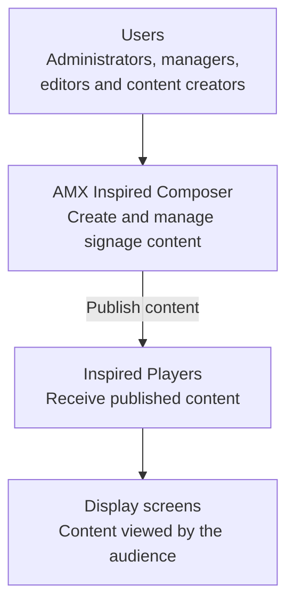

I authored the original user documentation for version 5 of AMX Composer, a content-management application for this AMX Digital Signage platform. Version 5 of Composer was a complete re-write of the original Windows Client Server based application with a completely new User Interface and web based technology stack.

The guide explains the product’s architecture and content model and supports administrators, managers, editors and content creators. It covers the complete digital-signage workflow, including creating messages from templates, managing playlists, scheduling and approving content, publishing to networked display players, configuring users and permissions, and generating playback reports. It also includes system-setup guidance, media specifications, error messages, troubleshooting information and advanced playlist concepts.

The following diagram shows a high level summary of the content flow:

The documentation was primarily delivered as context-sensitive HTML help bundled with the application. Using MadCap Flare’s single-sourcing capabilities, I also produced a 109-page PDF manual from the same source content. The PDF is the only version available without purchasing the application. View the manual on the [AMX website](https://www.amx.com/en/site_elements/reference-guide-composer-5-4-desktop-edition)

