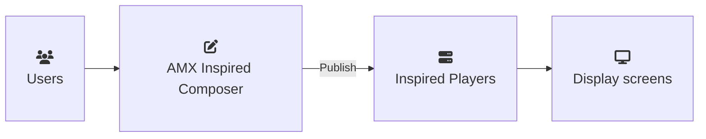

## Project overview

I wrote the user documentation for version 5 of AMX Composer, a content-management application for the AMX Digital Signage platform. Version 5 was a complete rewrite of the original Windows client-server application with many new features, a completely new user interface, and a new web-based technology stack.

The guide supported administrators and end users through the complete digital-signage workflow, from creating and approving content to publishing it to networked players. It also covered system configuration, permissions, reporting, troubleshooting, and advanced playlist concepts.

The following diagram shows a high-level summary of the content flow:

This work required a practical understanding of TCP/IP networking, player configuration, device connectivity, and troubleshooting networked digital-signage systems.

## The challenge

* Support administrators and end users without overwhelming either audience with irrelevant information.
* Produce context-sensitive HTML help and a printable PDF from the same source content.
* Minimise or eliminate duplicated content while allowing audience-specific variations.
* Understand and explain a complex digital-signage application clearly.

## My approach

I did extensive testing with the application and spent time discussing the concepts behind the product with the developers.

I created a single-source MadCap Flare project using reusable content, conditional text, separate build targets, and separate source TOCs. Shared concepts and procedures were maintained once, while administrator-only content was conditionally included in the relevant HTML and PDF outputs.

This approach produced audience-specific help without requiring separate documentation sets. I also used cross-references in place of HTML-only hyperlinks so that links remained usable in both the online and print outputs.

## Deliverables

* The primary output: two different context-sensitive HTML help bundles accessible within the application with the specific version determined by the user's role - either end user or administrator. 
* A secondary output: a PDF administrator manual containing the same content as the help bundles in print form. This PDF is the only version available without purchasing the application.

:::note[Published guide]

View the finished PDF manual on the [AMX website](https://www.amx.com/en/site_elements/reference-guide-composer-5-4-desktop-edition). Note the HTML help is not publicly available.

:::

## Outcome

The HTML help and PDF manual were successfully released with the product and received positive internal feedback from the developers and product manager.

## What I would change

* The PDF manual did not include a linked, page-numbered table of contents because I was unable to resolve an issue with Flare’s print output before the release deadline. I would now test print-navigation requirements earlier and allow more time to address output-specific issues.
* Include the glossary from the HTML help in the PDF manual so that readers could access definitions without using the application.
* Take advantage of modern automated proofreading tools like [Vale](https://github.com/vale-cli/vale) and [LanguageTool](https://github.com/languagetool-org/languagetool). My [portfolio integrates these checks](./DocusaurusPortfolio.md)
