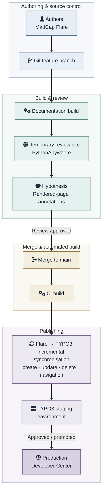

## Context

Following Optimal Payments' acquisition of Skrill Group in August 2015 and the combined business's subsequent rebranding as Paysafe, I led the documentation work for a ten-month project to create a unified Developer Center for the newly integrated company. The site brought together API and SDK reference documentation, integration guides, and product information for merchants integrating Paysafe's payment methods, replacing documentation previously distributed across the two businesses.

I defined the documentation strategy and information architecture, specified the authoring and publishing platform, planned the legacy-content migration, and worked with Paysafe's web development team and an external consultancy on the implementation. I led a team of three technical writers while remaining hands-on, authoring new API and integration documentation.

See current version of the [Paysafe Developer Center](https://developer.paysafe.com) for reference.

## Challenge

The project involved:

- consolidating and migrating hundreds of pages from the Optimal Payments Developer Center and Skrill's PDF-based documentation

- defining a scalable information architecture and consistent content structures for multiple payment APIs, SDKs, integration methods, product documentation, and reference material

- creating a Git-based workflow with repeatable build, review, and publishing processes

- building the team's technical capability to operate and maintain the new documentation platform

The documentation team needed a structured authoring and source-control workflow, while the public Developer Center had to operate within Paysafe's existing TYPO3-based web platform. The publishing process therefore needed to connect two very different content models without recreating the documentation manually in the CMS.

## Approach

I reviewed developer portals from PayPal, Braintree, and Stripe to identify effective patterns in developer experience, navigation, API reference documentation, and integration guidance, and used the findings to define requirements for both the Developer Center and its documentation toolchain.

From this research, I designed an information architecture based on product landing pages, hierarchical navigation, and consistent structures for getting-started content, integration guides, and API and SDK reference documentation.

Documentation changes were developed in Git feature branches and built for review before being merged to the main branch. A merge triggered an automated build and publication to a TYPO3 staging environment through the custom integration, where the documentation underwent final inspection before promotion to production.

Flare served as the authoritative documentation source, while TYPO3 acted as the delivery CMS; a custom publishing tool incrementally synchronised the two.

The TYPO3 integration created records for new content, updated changed records, removed deleted content, and synchronised changes to the Flare table of contents with the site's navigation. Because synchronisation applied only the required deltas, unchanged CMS records were not recreated and users' cached browser pages were not unnecessarily invalidated.

For urgent production fixes, changes could be made directly in TYPO3 and subsequently backported into Flare/Git, ensuring that the authoritative source was brought back into sync with production.

The following diagram summarizes the implementation:

## Implementation

I built post-build automation that published rendered Flare output to temporary PythonAnywhere review environments and integrated the open-source Hypothesis annotation tool. This allowed reviewers to comment directly on the rendered pages, rather than reviewing source files in isolation, before changes were merged and promoted through the publishing workflow.

I also built the production site's page-level feedback mechanism in JavaScript, with responses passed through a server-side component into JIRA for tracking and follow-up.

I developed migration tooling to transform and move hundreds of pages from the Confluence-based Optimal Payments Developer Center into the new platform.

My team and I migrated API reference material to API Blueprint, a machine-readable API description format similar in purpose to OpenAPI. The Developer Center used these structured definitions to generate parameter tables, code samples, and `curl` examples automatically, reducing manually duplicated content and improving consistency across the rendered API reference.

To make the new workflow sustainable beyond the initial implementation, I trained the three writers in MadCap Flare, Git, REST APIs, CSS, JavaScript, and the architecture of the Developer Center's build and publishing system. During adoption, I supported the team with source-control issues and merge conflicts and reviewed documentation changes for technical accuracy, clarity, and consistency. This combined hands-on support with capability development so that the team could increasingly operate and maintain the documentation platform independently.

## Impact

The first phase of the Developer Center soft-launched in December 2016 during a period of rapid growth and change at Paysafe. The company reported 2016 revenue of just over $1 billion while continuing to integrate the Skrill and Optimal Payments businesses.

The Developer Center had visibility at company level: Paysafe included its launch in its [2016 Annual Report](https://data.fca.org.uk/artefacts/NSM/data-migration/130622071.pdf) as one of the achievements supporting its “State-of-the-art technology” strategy and also mentioned it in its January 2017 trading update.

## Lessons learned

- Today, I would prefer a docs-as-code approach using extended Markdown and automated quality checks. This would lower the barrier to contributions for engineers and support staff while still supporting reuse, conditional content, linting, and link checking. In 2016, however, the hybrid Flare/Git approach was a pragmatic choice: it introduced source control and automated publishing without requiring the team to abandon a familiar structured authoring environment.

- For large-scale HTML migration, I would now use DOM-aware parsing and transformation, for example with Python and Beautiful Soup, rather than relying primarily on regular-expression transformations. The regex-based approach worked, but required more manual clean-up.