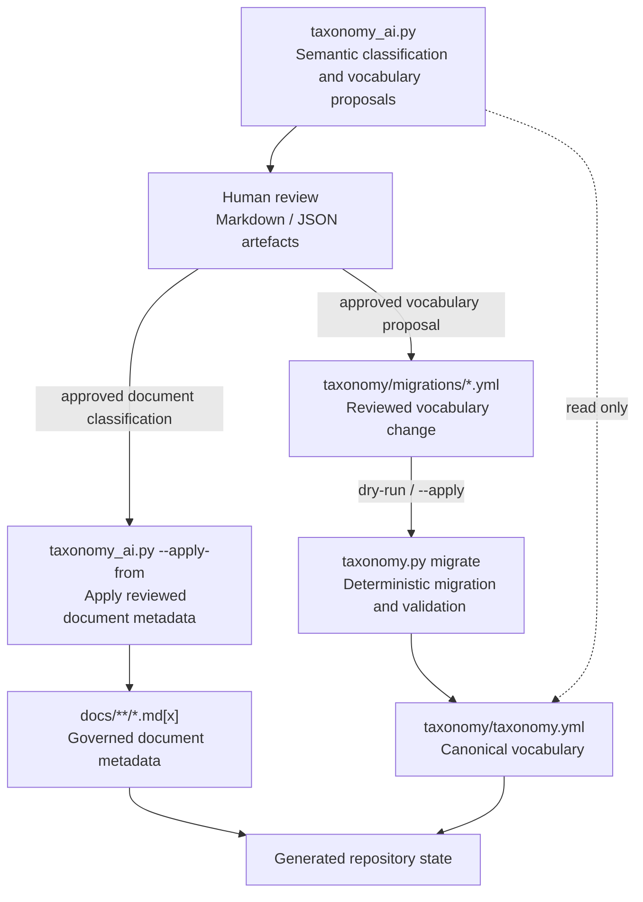
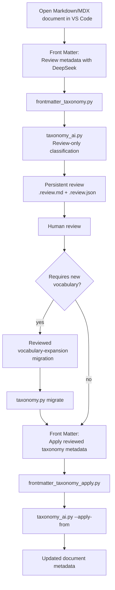

I designed and implemented a governed taxonomy for a Docusaurus documentation site. The project combines information architecture, docs-as-code automation, editor integration, deterministic repository validation, and AI-assisted semantic classification.

The aim was to make structured metadata practical for writers without allowing convenience tooling or an LLM to become an independent taxonomy authority. Writers can select controlled metadata in VS Code, use AI to review individual documents or the wider corpus, and propose vocabulary changes when genuinely new concepts appear. Canonical vocabulary changes remain explicit, reviewable repository operations.

## Problem

Documentation metadata supports several related documentation functions:

* **Search and discovery** — filtering, faceting, ranking, and findability.

* **Navigation generation** — menus, browse pages, indexes, and landing pages.

* **Vocabulary control** — preferred terms and approved metadata values.

* **Lifecycle management** — draft, current, deprecated, archived, and review states.

* **Audience targeting** — content for particular roles, groups, or experience levels.

* **Related-content generation** — connections by topic, product, task, technology, or audience.

* **QA and automation** — validation rules, publishing logic, and CI checks.

* **Content governance** — ownership, review dates, applicability, and maintenance responsibilities.

* **Analytics and gap analysis** — coverage measurement and identification of missing content.

* **AI and semantic retrieval** — structured context for semantic search, RAG, and knowledge graphs.

Free-form tags are easy to introduce but difficult to govern consistently as a documentation set grows. For this portfolio, I wanted metadata that:

* uses stable canonical IDs rather than inconsistent free-text labels;

* supports content type, audience, topic, technology, and lifecycle dimensions;

* works consistently across Markdown and MDX;

* drives Docusaurus tags and faceted navigation;

* remains convenient to edit through VS Code Front Matter;

* uses AI where semantic judgement is useful without granting the LLM repository authority;

* can evolve safely when terms are added, corrected, replaced, or deprecated.

## Authority model

Authority is divided by concern.

[`taxonomy/taxonomy.yml`](../../taxonomy/taxonomy.yml) is the canonical controlled vocabulary and taxonomy policy. `taxonomy_ai.py` can classify documents and propose semantic changes, but its fresh classification runs do not modify canonical taxonomy state. Reviewers record approved vocabulary changes as migration manifests, and `taxonomy.py` applies them deterministically.

Generated files are projections of the canonical taxonomy and validated document metadata. Generated files are not independent sources of taxonomy data.

| Concern                                     | Authoritative mechanism                                         |

| ------------------------------------------- | --------------------------------------------------------------- |

| Canonical vocabulary and taxonomy policy    | `taxonomy/taxonomy.yml`                                         |

| Semantic classification of content          | `taxonomy_ai.py`                                                |

| Approval or rejection of semantic proposals | Human review                                                    |

| Document metadata changes proposed by AI    | Reviewed artefact applied through `taxonomy_ai.py --apply-from` |

| Vocabulary-change contract                  | `taxonomy/taxonomy-migration.schema.json`                       |

| Reviewed vocabulary changes                 | `taxonomy/migrations/*.yml`                                     |

| Applying canonical taxonomy changes         | `taxonomy.py migrate`                                           |

| Structural and repository validation        | `taxonomy.py`                                                   |

| Final repository review                     | Git diff / pull-request review                                  |

The architecture enforces that separation:



There is deliberately no direct write path from `taxonomy_ai.py` to `taxonomy.yml`.

## Repository components and generated state

### Steady-state components

| Component                                 | Operational role                                                                                                                       |

| ----------------------------------------- | -------------------------------------------------------------------------------------------------------------------------------------- |

| `taxonomy/taxonomy.yml`                   | Defines the controlled vocabulary and taxonomy policy.                                                                                 |

| `scripts/taxonomy.py`                     | Validates taxonomy and document metadata, synchronises derived tags, regenerates projections, performs audits, and applies migrations. |

| `scripts/taxonomy_ai.py`                  | Performs semantic classification and produces document and vocabulary proposals for review.                                            |

| `taxonomy/taxonomy-migration.schema.json` | Defines and validates the migration-manifest structure.                                                                                |

| `taxonomy/migrations/*.yml`               | Stores reviewed, auditable vocabulary changes.                                                                                         |

| `frontmatter.config.cjs`                  | Loads the generated Front Matter projection and registers repository actions.                                                          |

| `scripts/frontmatter_taxonomy.py`         | Creates a persistent single-document AI review from VS Code Front Matter.                                                              |

| `scripts/frontmatter_taxonomy_apply.py`   | Applies a saved single-document review through `taxonomy_ai.py --apply-from`.                                                          |

Because `taxonomy.py` does not call an LLM, CI can use its checks as deterministic gates.

### Generated projections

The canonical taxonomy and validated document metadata produce three main repository projections:

| Generated file                                                                           | Purpose                                                                              |

| ---------------------------------------------------------------------------------------- | ------------------------------------------------------------------------------------ |

| [`docs/tags.yml`](../tags.yml)                                                           | Docusaurus tag definitions.                                                          |

| [`.frontmatter/generated-taxonomy.json`](../../.frontmatter/generated-taxonomy.json)     | Allowed metadata values and content-type field definitions for VS Code Front Matter. |

| [`src/generated/taxonomy-navigation.json`](../../src/generated/taxonomy-navigation.json) | Faceted navigation data derived from taxonomy terms and document metadata.           |

`taxonomy.py` checks generated files against the output expected from canonical state. It therefore detects manual edits or stale projections as repository drift rather than accepting them as independent taxonomy changes.

The generated navigation projection drives the site's [browse page](pathname:///browse/).

## VS Code Front Matter authoring workflow

Front Matter CMS provides the editor-facing content-management layer for Markdown and MDX files. In this project it is a controlled authoring interface: writers can work with structured fields and repository actions without manually remembering canonical IDs or YAML structures.

1. **Structured metadata editing.** Front Matter presents governed front-matter fields as editor controls.

2. **Controlled taxonomy choices.** `taxonomy.py generate` creates `.frontmatter/generated-taxonomy.json`. `frontmatter.config.cjs` loads that file into `frontMatter.taxonomy.customTaxonomy` and `frontMatter.taxonomy.contentTypes`, so the editor reflects the current controlled vocabulary and content-type-specific constraints.

3. **Single-document AI review.** A Front Matter action launches `frontmatter_taxonomy.py` for the active document. The wrapper invokes `taxonomy_ai.py` in review-only mode and stores document-specific review artefacts in `.frontmatter/taxonomy-reviews/`.

4. **Reviewed apply.** A second action launches `frontmatter_taxonomy_apply.py`. It delegates to the saved-review application path and ultimately invokes `taxonomy_ai.py --apply-from <saved-review.json>`. It does not perform a fresh classification request.

```javascript id="6bbfcr"

"frontMatter.custom.scripts": [

  {

    "id": "suggest-taxonomy-deepseek",

    "title": "Review metadata with DeepSeek",

    "script": "./scripts/frontmatter_taxonomy.py",

    "command": "python",

    "type": "content"

  },

  {

    "id": "apply-taxonomy-review",

    "title": "Apply reviewed taxonomy metadata",

    "script": "./scripts/frontmatter_taxonomy_apply.py",

    "command": "python",

    "type": "content"

  }

]

```

For a document such as:

```text id="o2lw3p"

docs/case-studies/taxonomy.md

```

the review wrapper persists:

```text id="v5qt0e"

.frontmatter/taxonomy-reviews/

└── case-studies/

    ├── taxonomy.review.md

    └── taxonomy.review.json

```

The Markdown artefact provides the human-readable review surface. The JSON artefact contains the exact machine-readable review that the apply operation consumes.

Front Matter can expose taxonomy-editing functionality of its own, but those editor-side operations are not the supported path for changing the canonical vocabulary. Vocabulary changes use the [governed migration workflow](#governed-taxonomy-migrations), which provides preconditions, corpus validation, and a reviewable Git diff.

### Single-document workflow



If the review references a proposed term that is not yet canonical, the document cannot adopt it until a reviewer approves the migration and `taxonomy.py` applies it.

## Operations

### Routine taxonomy maintenance

```powershell id="xl7xyf"

python scripts/taxonomy.py check --all

python scripts/taxonomy.py sync --all

python scripts/taxonomy.py generate

python scripts/taxonomy.py audit-technologies

python scripts/taxonomy.py audit-unused

```

| Command              | Purpose                                                                       |

| -------------------- | ----------------------------------------------------------------------------- |

| `check`              | Validate taxonomy structure, governed document metadata, and generated state. |

| `sync`               | Synchronise derived document tags with governed taxonomy dimensions.          |

| `generate`           | Regenerate repository projections from current canonical state.               |

| `audit-technologies` | Identify questionable technology terms or technology-kind assignments.        |

| `audit-unused`       | Report active terms with no direct references in the document corpus.         |

| `migrate`            | Dry-run or apply an approved taxonomy migration.                              |

`audit-unused` is intentionally read-only. It identifies contraction candidates; it does not decide that an unused term should be removed or deprecated. See [Content-driven contraction](#content-driven-contraction).

### AI-assisted classification

The AI layer can review an individual document or the complete document set:

```powershell id="hmkbda"

python scripts/taxonomy_ai.py docs/example.md

python scripts/taxonomy_ai.py --all

```

* classify content against active taxonomy terms;

* suggest missing title or description metadata;

* identify concepts that are not represented in the current vocabulary;

* produce Markdown and JSON review artefacts;

* draft a migration proposal when a reusable concept appears to require vocabulary expansion.

Fresh classification runs are review-only.

After human review, `taxonomy_ai.py --apply-from` applies document metadata from the saved machine-readable artefact:

```powershell id="88d2hl"

python scripts/taxonomy_ai.py --apply-from taxonomy/taxonomy-ai-suggestions.json

```

`--apply-from` is the document-metadata write path in `taxonomy_ai.py`; it applies the saved review instead of asking the model to classify the document again.

The application fails if reviewed metadata references a non-canonical term. Vocabulary adoption is handled separately through the migration process below.

### Governed taxonomy migrations

Reviewers record canonical taxonomy changes as declarative YAML manifests, and `taxonomy.py` validates them against `taxonomy/taxonomy-migration.schema.json`.

Version 2 migration manifests record both the **intent** of the migration and the **trigger** that caused it.

Supported change types are:

* `vocabulary-expansion`

* `vocabulary-contraction`

* `taxonomy-correction`

* `term-replacement`

* `policy-change`

Supported triggers are:

* `content-driven`

* `taxonomy-review`

* `policy-driven`

Change type describes what changes; trigger describes why.

`taxonomy_ai.py` drafts proposals for genuinely missing reusable terms as `vocabulary-expansion` migrations with a `content-driven` trigger. `taxonomy_ai.py` validates the draft before writing it; a reviewer approves it before application.

#### Migration preconditions

Migrations can declare assumptions about the repository state they expect to modify.

A migration-level precondition can constrain the taxonomy version:

```yaml id="mpjhix"

preconditions:

  taxonomy_version: 2

```

Individual updates can also use `expect` to state the current value that must still be present:

```yaml id="hcnc5t"

json:

  expect:

    kind: markup-content-language

  set:

    kind: data-format

```

These checks provide stale-state protection. If the canonical taxonomy no longer matches the state the reviewer approved, `taxonomy.py` fails the migration rather than overwriting the newer value.

Preconditions therefore make the migration manifest both a change description and an assertion about the state to which that change is safe to apply.

#### Content-driven expansion

A new document may introduce a reusable concept missing from the canonical vocabulary.

In that situation:

```text id="9r9sa1"

new or changed content

        ↓

semantic review identifies a vocabulary gap

        ↓

vocabulary-expansion proposal

        ↓

human review

        ↓

migration dry-run

        ↓

approved migration application

```

The AI layer can identify and describe the gap, but adding the term requires a reviewed migration.

#### Content-driven contraction

Deleting or reclassifying content can leave an active term with no direct document references. `taxonomy.py audit-unused` reports those terms as candidates for review.

`taxonomy.py` does not remove unused terms automatically. A reviewer decides whether to keep, replace, or deprecate the term.

Where contraction is appropriate, the system prefers **deprecation to deletion** so that stable IDs, provenance, Git history, and replacement relationships remain available.

`taxonomy.py` rejects contraction while documents still reference the target term.

#### Taxonomy correction

Vocabulary can require correction even when the document corpus has not introduced or removed a concept.

A taxonomy review might identify an incorrect:

* classification;

* description;

* parent relationship;

* alias;

* technology kind;

* or other governed property.

Reviewers record those changes as `taxonomy-correction` migrations rather than as content-driven expansion or contraction.

#### Migration preflight

`taxonomy.py migrate` defaults to a dry-run; `--apply` writes the changes:

```powershell id="3mp91m"

python scripts/taxonomy.py migrate `

  taxonomy/migrations/2026-09-01-correct-technology-kinds.yml

```

For the technology-kind correction described below, a successful dry-run produced:

```text id="gd6sgg"

migration: 2026-09-01-correct-technology-kinds

description: Correct technology kinds that conflict with the controlled kind definitions.

operations: update=5

documents scanned: 26

documents requiring deterministic rewrite: 0

dry-run passed; no files changed

use --apply to write the migration

```

`documents requiring deterministic rewrite` identifies documents whose front matter would need to change because of a canonical-ID operation.

Before writing repository state, the migration engine:

1. validates the migration manifest.

2. checks its preconditions.

3. constructs the candidate taxonomy.

4. validates that candidate taxonomy.

5. scans the document corpus for affected metadata.

6. determines any deterministic document rewrites required by canonical-ID changes.

```powershell id="3c03p3"

python scripts/taxonomy.py migrate `

  taxonomy/migrations/2026-09-01-correct-technology-kinds.yml `

  --apply

```

Reviewers can then inspect the resulting repository changes as a Git diff before merging them.

## Example: correcting technology kinds

During a taxonomy review, I found five technology terms whose assigned kinds did not match the controlled definitions.

The taxonomy assigned JSON, YAML, and XML to `markup-content-language`, but the controlled model defines them as `data-format`. It assigned Apple Pay and Google Pay to `software-platform`, although the controlled model provides `payment-technology` for those technologies.

I represented the correction as a reviewed migration:

```yaml id="rzgd57"

schema_version: 2

id: 2026-09-01-correct-technology-kinds

change_type: taxonomy-correction

trigger: taxonomy-review

description: Correct technology kinds that conflict with the controlled kind definitions.

governance:

  date: "2026-09-01"

  source: migration

  reason: >-

    Align existing technology terms with the taxonomy's controlled kind definitions.

preconditions:

  taxonomy_version: 2

changes:

  technologies:

    update:

      json:

        expect:

          kind: markup-content-language

        set:

          kind: data-format

      yaml:

        expect:

          kind: markup-content-language

        set:

          kind: data-format

      xml:

        expect:

          kind: markup-content-language

        set:

          kind: data-format

      apple-pay:

        expect:

          kind: software-platform

        set:

          kind: payment-technology

      google-pay:

        expect:

          kind: software-platform

        set:

          kind: payment-technology

```

The `expect` clauses ensure that `taxonomy.py` applies the correction only to the taxonomy state the reviewer approved.

## Case study: preflight caught repository drift

The first dry-run of the technology-kind migration reported that one document required an update.

A full repository check showed that the newly added taxonomy case-study document already contained governed taxonomy metadata but had an empty derived `tags` field. The generated navigation projection was also stale.

I repaired the derived state before continuing:

```powershell id="na87ha"

python scripts/taxonomy.py sync docs/case-studies/taxonomy.md

python scripts/taxonomy.py check --all

```

After the repair, the dry-run scanned all 26 documents and required no rewrites.

Preflight exposed unrelated repository drift and prevented stale derived state from entering the migration.

## Evolution of the tooling

The implementation evolved from one-off discovery and conversion scripts into the current governed maintenance model:

```text id="avn081"

generate_taxonomy.py

    ↓

initial AI-assisted taxonomy discovery

upgrade_taxonomy.py

    ↓

one-off taxonomy v1 → v2 conversion

taxonomy.py + taxonomy_ai.py

    ↓

steady-state governed maintenance

```

`generate_taxonomy.py` was useful for initial taxonomy discovery, and `upgrade_taxonomy.py` handled the historical version transition. Neither is part of the normal steady-state workflow.

The current architecture concentrates repository authority in the maintained taxonomy and migration tooling instead of retaining multiple historical paths capable of shaping canonical state.

## Outcomes, trade-offs, and next steps

### Measured outcome

In the technology-kind correction, the migration engine checked five vocabulary updates against all 26 portfolio documents before any repository state was changed.

The migration required no document metadata rewrites because it changed governed properties without changing the canonical term IDs.

The failed preflight exposed stale derived state before `taxonomy.py` applied the migration. Together, those results verified that the migration engine could check vocabulary changes against both the controlled taxonomy and the document corpus before writing them.

For authors, the same implementation provides structured taxonomy choices and persistent AI-review artefacts inside VS Code without requiring the editor integration to manage canonical vocabulary directly.

### Trade-offs

The design deliberately favours explicit review over automatic taxonomy evolution.

That creates additional steps compared with automatically accepting AI suggestions or deleting unused terms. In return, reviewers can inspect semantic proposals, document metadata changes, and canonical vocabulary changes separately, and can reproduce and audit repository changes through version control.

### Next steps

* Adding content and taxonomy fingerprints to AI review artefacts so `--apply-from` can reject stale reviews more precisely;

* Adding a local content-addressed cache for unchanged AI classification requests;

* Retiring or archiving the historical bootstrap and v1-to-v2 migration scripts;

* Continuing semantic review where the existing technology-kind model does not provide an unambiguous classification.

The main improvement is that components now own actions explicitly: reviewers **record/inspect**, `taxonomy.py` **checks/applies/rejects**, `taxonomy_ai.py` **drafts/applies document metadata**, and Front Matter **presents** controls.
