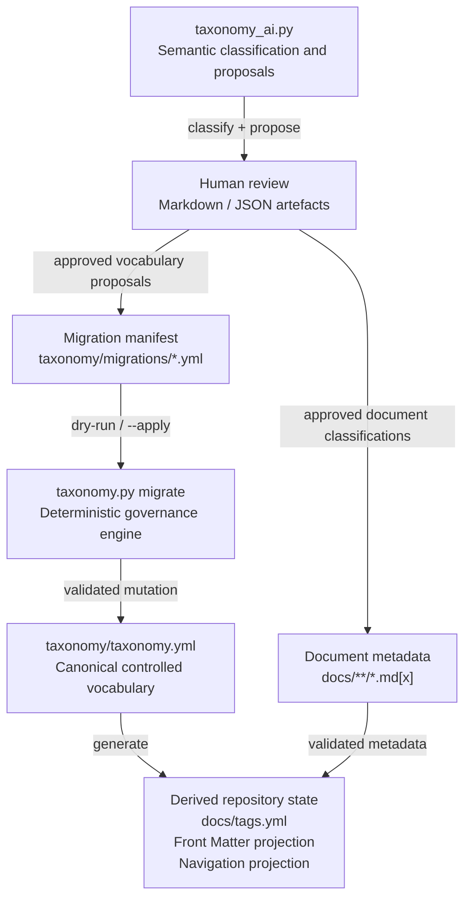

# Taxonomy Support - Work In Progress

- The canonical taxonomy is stored and versioned in Git at [taxonomy\taxonomy.yml](../../taxonomy/taxonomy.yml).

- This is used to generate Docusaurus tags shown at the bottom of rendered pages - [`docs/tags.yml`](../tags.yml) and the list of allowed metadata for adding to Markdown files using the Frontmatter extension in VScode.[`frontmatter/generated-taxonomy.json`](../../.frontmatter/generated-taxonomy.json).

| Script                         | Role                                                                                                                                                                                                                                                                                                                           | Main commands / args used for that role                                                                                                                                                                                                                                                                                                                                                                                                                                                                                                                                                                                         | Recommendation                                                                      |
| ------------------------------ | ------------------------------------------------------------------------------------------------------------------------------------------------------------------------------------------------------------------------------------------------------------------------------------------------------------------------------ | ------------------------------------------------------------------------------------------------------------------------------------------------------------------------------------------------------------------------------------------------------------------------------------------------------------------------------------------------------------------------------------------------------------------------------------------------------------------------------------------------------------------------------------------------------------------------------------------------------------------------------- | ----------------------------------------------------------------------------------- |
| `taxonomy.py`                  | **Deterministic source-of-truth tooling around `taxonomy.yml`.** Validates taxonomy structure/semantics, validates `.md/.mdx` front matter, regenerates derived files, synchronises derived Docusaurus tags, and provides CI-safe technology auditing. No LLM.                                                                 | `generate` — regenerate `docs/tags.yml`, `.frontmatter/generated-taxonomy.json`, navigation JSON. `check --all` — validate taxonomy + every document. `check <paths>` — validate selected docs. `check --changed-base <sha>` — validate changed docs, or all docs if taxonomy changed. `check --taxonomy-only` — taxonomy + generated-file checks only. `sync --all` / `sync <paths>` / `sync --changed-base <sha>` — recompute `tags` from governed dimensions. `audit-technologies` — report technology counts/kinds and organisation-like terms; `--strict` makes warnings fail CI. Global `--root` selects repository root. | **Keep — core repository engine**                                                   |
| `taxonomy_ai.py`               | **Semantic AI layer on top of the canonical taxonomy.** Reads the current `taxonomy.yml`, classifies document content into existing terms, suggests missing title/description, proposes genuinely missing taxonomy terms, canonicalises labels/aliases to IDs, verifies proposal evidence, and enforces taxonomy cardinality.  | `<paths>` — classify specific docs/directories. `--all` — classify the entire docs corpus. `--changed-base <sha>` — classify only changed docs. `--apply` — write accepted metadata/new terms to the working tree, sync tags and regenerate derived files. `--model` — choose DeepSeek model. `--introduced-date` — governance date for AI-added taxonomy terms. `--output` / `--json-output` — review reports. `--max-file-chars` / `--max-tokens` — AI request limits. `--root` — repository root.                                                                                                                            | **Keep — ongoing AI adviser/classifier**                                            |
| `frontmatter_taxonomy.py`      | Thin VS Code / Front Matter UI wrapper around `taxonomy_ai.py` for a single document.                                                                                                                                                                                                                                          | Called with `<workspace-root> <document>`. Internally invokes `taxonomy_ai.py --root ... --output ... --json-output ... <document>`, opens the Markdown review in VS Code, then deletes the temporary reports when closed.                                                                                                                                                                                                                                                                                                                                                                                                      | **Keep if the Front Matter workflow is useful**                                     |
| `generate_taxonomy.py`         | Whole-repository AI **bootstrap/discovery** process: discovers content types, audiences, topics and technologies, performs technology coverage audit and consolidation, then creates a new canonical taxonomy.                                                                                                                 | `--force` — overwrite an existing taxonomy; should now be used very cautiously. `--extraction-model`, `--coverage-model`, `--chunk-consolidation-model`, `--consolidation-model` — models for different AI passes. `--batch-chars`, `--consolidation-chunk-size`, `--max-file-chars`, `--max-tokens` — batching/context limits. `--cache-dir`, `--no-cache`, `--refresh-cache` — resumable AI cache. `--skip-coverage-audit` — skip second technology pass. `--introduced-date` — initial governance date. `--root` — repository root.                                                                                          | **Bootstrap only; de-emphasise or rename `bootstrap_taxonomy.py`**                  |
| `upgrade_taxonomy.py`          | Historical AI-assisted **v1 → v2 migration**, primarily adding technology `kind`s and identifying organisations incorrectly stored as technologies.                                                                                                                                                                            | Default run — produce review reports only. `--apply` — perform migration. `--recheck-v2` — allow the old migration logic to audit an already-v2 taxonomy. `--model`, `--batch-size`, `--max-tokens` — AI processing controls. `--output` / `--json-output` — reports. `--root` — repository root.                                                                                                                                                                                                                                                                                                                               | **Deprecate/archive now v2 is established**                                         |
| Proposed `taxonomy.py migrate` | **Deterministic repository migration** after an intentional canonical taxonomy change—for example ID replacement/deprecation that requires updating affected front matter.                                                                                                                                                     | Suggested shape: `migrate <migration-file>` for dry-run; `migrate <migration-file> --apply` to change `taxonomy.yml`, rewrite only affected docs, sync tags, regenerate derived files and validate everything.                                                                                                                                                                                                                                                                                                                                                                                                                  | **Add to `taxonomy.py` rather than creating another standalone maintenance script** |

The operational split is essentially:

* **`taxonomy.py check/generate/sync`** → repository consistency and mechanical consequences.
* **`taxonomy.py migrate`** → explicit deterministic taxonomy changes that propagate to documents.
* **`taxonomy_ai.py <docs>`** → semantic judgement about what a document means.
* **`taxonomy_ai.py --all`** → corpus-wide semantic reclassification/audit, not routine maintenance.
* **`taxonomy_ai.py --apply`** → only after reviewing AI proposals/classifications.
