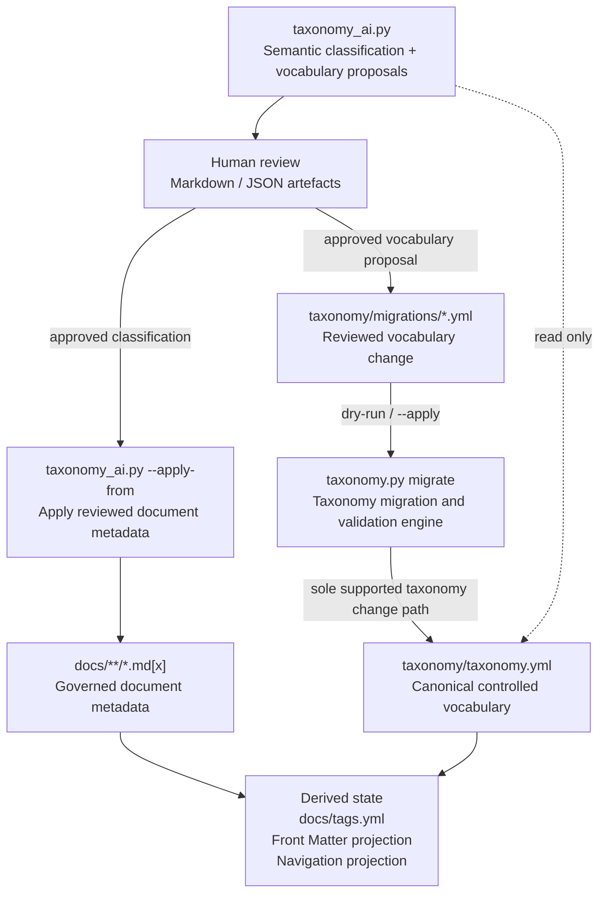
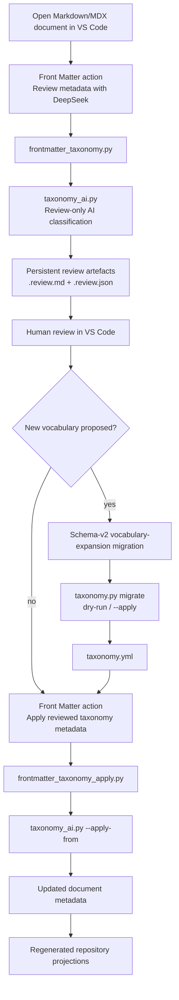

I designed and implemented a governed taxonomy for a Docusaurus documentation site. The project combined information architecture, docs-as-code automation, editor integration, and AI-assisted classification.

My goal was not only to generate tags, but also to build a system in which writers could classify content efficiently while canonical metadata remained consistent, reviewable, and auditable.

I implemented the taxonomy schema, validation and migration tooling, AI review workflow, and editor integration to make it easy for writers to select appropriate tags from controlled metadata when tagging their documents. The system validates taxonomy changes against the entire documentation set before applying them. All AI suggestions are reviewed by a human before they can affect document metadata or the canonical taxonomy.

The canonical vocabulary is stored in [`taxonomy/taxonomy.yml`](../../taxonomy/taxonomy.yml) and versioned in Git. It is used to generate Docusaurus tags, the metadata choices available to users in VS Code Front Matter, and the site's taxonomy navigation index — see the [browse page](pathname:///browse/).

## Problem

Free-form content tags are easy to add but difficult to govern consistently over time. As the portfolio expanded, I wanted metadata that:

* used stable canonical IDs rather than inconsistent free-text labels;
* supported content type, audience, topic, technology, and lifecycle dimensions;
* remained valid across Markdown and MDX documents;
* generated Docusaurus tags and navigation from the canonical taxonomy;
* was convenient to edit through VS Code Front Matter;
* used AI for semantic classification without making an LLM authoritative;
* evolved safely when terms were added, corrected, replaced, or deprecated.

## Design principles

### One canonical vocabulary

`taxonomy/taxonomy.yml` is the source of truth. Generated files are projections of that canonical state and are not intended to be maintained independently.

### AI is advisory

`taxonomy_ai.py` performs semantic classification on a Markdown file or set of files and identifies potential vocabulary gaps. It produces review artefacts rather than directly changing the canonical taxonomy.

### Central taxonomy validation, auditing, and modification tooling

`taxonomy.py` validates taxonomy structure and semantics as well as document front matter. It synchronises derived tags, regenerates projections, audits the taxonomy for quality issues such as unused metadata, and applies reviewed migration files.

It does not call an LLM and is suitable for blocking CI checks.

### Human review separates proposals from repository changes

A semantic proposal is not automatically a taxonomy change. New or modified vocabulary must be represented by a reviewed migration file before `taxonomy.py migrate` can change `taxonomy.yml`.

## Architecture



The important boundary is that there is no direct write path from `taxonomy_ai.py` to `taxonomy.yml`.

## Components

| Component                                 | Responsibility                                                                     | Authority                                               |
| ----------------------------------------- | ---------------------------------------------------------------------------------- | ------------------------------------------------------- |
| `taxonomy/taxonomy.yml`                   | Controlled vocabulary and taxonomy policy                                          | **Canonical state**                                     |
| `scripts/taxonomy.py`                     | Validation, generation, sync, audits, and migrations                               | Sole supported path for changing the canonical taxonomy |
| `scripts/taxonomy_ai.py`                  | Semantic classification and vocabulary proposals                                   | Advisory; reviewed document metadata only               |
| `taxonomy/taxonomy-migration.schema.json` | Validates migration-manifest structure                                             | Migration contract                                      |
| `taxonomy/migrations/*.yml`               | Auditable vocabulary changes                                                       | Human-reviewed change records                           |
| `.frontmatter/generated-taxonomy.json`    | Allowed taxonomy values and generated content-type fields for VS Code Front Matter | Generated projection                                    |
| `frontmatter.config.cjs`                  | Loads the generated Front Matter projection and registers repository actions       | Editor integration                                      |
| `scripts/frontmatter_taxonomy.py`         | Creates a persistent single-document AI review                                     | UI convenience; review-only                             |
| `scripts/frontmatter_taxonomy_apply.py`   | Applies the saved single-document review through `taxonomy_ai.py --apply-from`     | UI convenience; applies saved reviewed metadata         |
| `docs/tags.yml`                           | Docusaurus tag definitions                                                         | Generated projection                                    |
| `src/generated/taxonomy-navigation.json`  | Faceted navigation data                                                            | Generated projection                                    |
| `generate_taxonomy.py`                    | Initial AI-assisted taxonomy discovery                                             | Bootstrap only                                          |
| `upgrade_taxonomy.py`                     | Historical v1 to v2 transition                                                     | Legacy migration tooling                                |

## VS Code Front Matter CMS integration

Front Matter CMS is the editor-based content-management layer for the Docusaurus repository used by writers. It provides a CMS-style interface inside VS Code for Markdown and MDX content, including structured metadata editing.

In this project, Front Matter is used primarily as a **controlled authoring interface**, not as the source of truth for the taxonomy.

The integration has four responsibilities:

1. **Structured metadata editing.** The extension presents governed front-matter fields as editor controls instead of requiring authors to remember canonical IDs and YAML structure manually.

2. **Generating taxonomy choices.** `taxonomy.py generate` writes `.frontmatter/generated-taxonomy.json`. `frontmatter.config.cjs` loads that projection into `frontMatter.taxonomy.customTaxonomy` and `frontMatter.taxonomy.contentTypes`, so the editor UI reflects the current canonical taxonomy and its content-type-specific field constraints.

3. **Single-document AI review.** Users can click a custom Front Matter action to launch `frontmatter_taxonomy.py` for the active document. That wrapper runs `taxonomy_ai.py` in review-only mode, which calls the LLM to suggest changes to the document's metadata. It stores document-specific review artefacts in `.frontmatter/taxonomy-reviews/`.

4. **Reviewed apply.** Users can click a second custom Front Matter action to update the current document's metadata with the reviewed AI suggestions. It launches `frontmatter_taxonomy_apply.py`, which delegates to `frontmatter_taxonomy.py --apply`. This wrapper then calls `taxonomy_ai.py --apply-from <saved-review.json>` to apply the saved changes to the document. No new classification request is made during this step.

The registered actions are shown below. The `title` value is the UI button text for each action:

```javascript
"frontMatter.custom.scripts": [
  {
    "id": "suggest-taxonomy-deepseek",
    "title": "Review metadata with DeepSeek",
    "script": "./scripts/frontmatter_taxonomy.py",
    "command": "python",
    "type": "content"
  },
  {
    "id": "apply-taxonomy-review",
    "title": "Apply reviewed taxonomy metadata",
    "script": "./scripts/frontmatter_taxonomy_apply.py",
    "command": "python",
    "type": "content"
  }
]
```

For a document such as:

```text
docs/case-studies/taxonomy.md
```

the review wrapper persists:

```text
.frontmatter/taxonomy-reviews/
└── case-studies/
    ├── taxonomy.review.md
    └── taxonomy.review.json
```

The Markdown file is the human-readable review surface. The JSON file is the exact machine-readable artefact used by `--apply-from`.

### Front Matter features versus repository authority

Front Matter's taxonomy UI can add, edit, merge, move, and delete taxonomy values. This project does **not** treat those actions as the supported way to change the canonical controlled vocabulary. Direct editor-side taxonomy changes would bypass migration preconditions, corpus validation, and review of the resulting Git diff.

The boundary is therefore:

```text
Front Matter CMS
    = authoring UI + review/apply actions

.frontmatter/generated-taxonomy.json
    = generated editor projection

taxonomy/taxonomy.yml
    = canonical controlled vocabulary

taxonomy.py migrate
    = sole supported path for changing the canonical vocabulary
```

This lets the extension provide CMS convenience without becoming a second taxonomy authority.

### Single-document front matter workflow



If a review proposes a new taxonomy term, the new term cannot be applied as metadata to the current document until it has been reviewed and adopted using the migration workflow. This keeps the single-document editor experience consistent with the wider governance model.

## Taxonomy maintenance workflow

The core maintenance commands are:

```powershell
python scripts/taxonomy.py check --all
python scripts/taxonomy.py sync --all
python scripts/taxonomy.py generate
python scripts/taxonomy.py audit-technologies
python scripts/taxonomy.py audit-unused
```

These work as follows:

| Command              | Purpose                                                                 |
| -------------------- | ----------------------------------------------------------------------- |
| `check`              | Is the taxonomy, document metadata, and generated state valid?          |
| `sync`               | Are derived document tags consistent with governed taxonomy dimensions? |
| `generate`           | Are generated repository projections current?                           |
| `audit-technologies` | Are technology terms and kinds internally credible?                     |
| `audit-unused`       | Which active terms have zero direct document references?                |
| `migrate`            | Can an approved taxonomy change be applied safely?                      |

`audit-unused` is intentionally read-only. A zero-reference term is a contraction candidate, not an instruction to delete it.

## AI-assisted classification workflow

The AI layer can classify selected documents or the full set of documents:

```powershell
python scripts/taxonomy_ai.py docs/example.md
python scripts/taxonomy_ai.py --all
```

A review run can:

* classify content against existing active taxonomy terms;
* propose missing title or description metadata;
* identify vocabulary gaps;
* produce Markdown and JSON review artefacts;
* produce a draft migration manifest for genuinely missing terms.

Reviewed document metadata is applied separately:

```powershell
python scripts/taxonomy_ai.py --apply-from taxonomy/taxonomy-ai-suggestions.json
```

`--apply-from` is the only way to modify document metadata in `taxonomy_ai.py`. Fresh classification runs are review-only.

This application step cannot adopt a new canonical term. If the reviewed metadata references a proposed term that has not been added to the taxonomy through a migration, the apply step fails.

AI-generated vocabulary proposals are classified as `vocabulary-expansion` migrations with a `content-driven` trigger and are validated against `taxonomy/taxonomy-migration.schema.json` before the draft migration file is written.

This creates a two-stage authority model:

```text
AI semantic judgement
        ↓
reviewed classification
        ↓
document metadata

AI vocabulary proposal
        ↓
human review
        ↓
migration manifest
        ↓
taxonomy.py migrate
        ↓
canonical taxonomy
```

## Governed taxonomy migrations

Taxonomy changes are represented as declarative YAML manifests validated against `taxonomy/taxonomy-migration.schema.json`.

Version 2 of the migration file schema records both the **intent** of the change and the **trigger** that caused it.

Supported **change types** include:

* `vocabulary-expansion`
* `vocabulary-contraction`
* `taxonomy-correction`
* `term-replacement`
* `policy-change`

Supported **triggers** include:

* `content-driven`
* `taxonomy-review`
* `policy-driven`

This separates *why* a migration exists from the individual operations it performs.

### Content-driven expansion

When a new document contains a reusable concept that is not represented by the existing controlled vocabulary, `taxonomy_ai.py` can propose an expansion migration.

```text
content added
    ↓
semantic classification
    ↓
missing reusable concept
    ↓
vocabulary-expansion candidate
    ↓
human review
    ↓
taxonomy.py migrate
```

AI proposes the term; it does not add the term directly.

### Content-driven contraction

When content is deleted or reclassified, an existing taxonomy term may become unused. `taxonomy.py audit-unused` detects active terms with zero direct references.

```text
content removed
    ↓
audit-unused
    ↓
zero-reference term
    ↓
contraction candidate
    ↓
human review
    ↓
deprecation migration
```

The system prefers **deprecation to deletion** so stable IDs, Git history, provenance, and replacement relationships remain intact.

A contraction migration is rejected if documents still reference the term being deprecated.

### Taxonomy correction

Vocabulary can also change independently of content. A taxonomy-quality review may find that an existing term has the wrong classification, description, parent, alias, or other governed property.

That is represented as a `taxonomy-correction` migration rather than a content-driven expansion or contraction.

## Example: correcting technology kinds

A taxonomy review found that several technology terms conflicted with the controlled technology-kind definitions. For example, JSON, YAML, and XML were classified as markup/content languages even though the taxonomy defines them as structured data formats. Apple Pay and Google Pay were classified as generic software platforms even though the taxonomy has a payment-specific technology kind.

I represented the correction as a reviewed migration:

```yaml
schema_version: 2
id: 2026-09-01-correct-technology-kinds
change_type: taxonomy-correction
trigger: taxonomy-review
description: Correct technology kinds that conflict with the controlled kind definitions.

governance:
  date: "2026-09-01"
  source: migration
  reason: >-
    Align existing technology terms with the taxonomy's controlled kind definitions.

preconditions:
  taxonomy_version: 2

changes:
  technologies:
    update:
      json:
        expect:
          kind: markup-content-language
        set:
          kind: data-format

      yaml:
        expect:
          kind: markup-content-language
        set:
          kind: data-format

      xml:
        expect:
          kind: markup-content-language
        set:
          kind: data-format

      apple-pay:
        expect:
          kind: software-platform
        set:
          kind: payment-technology

      google-pay:
        expect:
          kind: software-platform
        set:
          kind: payment-technology
```

The `expect` values act as stale-state guards. If another change has already modified one of those terms, the migration fails rather than silently overwriting the newer state.

## Migration preflight

Migrations carry out a dry-run by default:

```powershell
python scripts/taxonomy.py migrate `
  taxonomy/migrations/2026-09-01-correct-technology-kinds.yml
```

A successful dry-run produces:

```text
migration: 2026-09-01-correct-technology-kinds
description: Correct technology kinds that conflict with the controlled kind definitions.
operations: update=5
documents scanned: 26
documents requiring deterministic rewrite: 0
dry-run passed; no files changed
use --apply to write the migration
```

The `documents requiring deterministic rewrite` wording above is the literal command output. In practice, this check identifies documents whose front matter would need to be rewritten because of canonical ID changes.

The engine constructs and validates the candidate taxonomy before changing repository state. It also scans the document corpus to determine whether canonical ID changes would require front-matter rewrites.

The migration is only written after an explicit:

```powershell
python scripts/taxonomy.py migrate `
  taxonomy/migrations/2026-09-01-correct-technology-kinds.yml `
  --apply
```

## Preflight caught unrelated repository drift

The first dry-run of the same migration reported that one document required an update. Running the full repository check showed that the newly added taxonomy case study document had governed taxonomy metadata but contained an empty derived `tags` field, and the navigation projection was also stale.

I corrected the derived state as follows:

```powershell
python scripts/taxonomy.py sync docs/case-studies/taxonomy.md
python scripts/taxonomy.py check --all
```

After that, the migration dry-run reported:

```text
documents scanned: 26
documents requiring deterministic rewrite: 0
dry-run passed; no files changed
```

This showed that the migration preflight was not only checking the requested vocabulary changes. It also prevented an unrelated repository inconsistency from being carried into the migration.

## AI and repository tooling responsibilities

| Question                                          | Mechanism                       |
| ------------------------------------------------- | ------------------------------- |
| What is this document about?                      | AI semantic classification      |
| Is `openapi` a valid active canonical ID?         | Repository validation           |
| Does metadata exceed cardinality constraints?     | Repository validation           |
| Is a genuinely new concept missing?               | AI proposal + human review      |
| Can that proposal directly modify `taxonomy.yml`? | No                              |
| Is a migration structurally valid?                | JSON Schema                     |
| Has the value expected by the migration changed?  | Migration `expect` precondition |
| Should an old ID become a new ID everywhere?      | Explicit ID replacement         |
| Is an active term unused by the corpus?           | `audit-unused`                  |
| Should an unused term be deprecated?              | Human governance decision       |
| Are generated files current?                      | Generated-state validation      |

The distinction is straightforward: the LLM is used where semantic judgement is useful, while repository tooling validates structure, applies approved changes, checks generated state, and enforces the taxonomy rules.

## Generated repository state

The canonical taxonomy and validated document metadata generate three main repository projections:

* [`docs/tags.yml`](../tags.yml) — Docusaurus tag definitions;
* [`.frontmatter/generated-taxonomy.json`](../../.frontmatter/generated-taxonomy.json) — allowed metadata values for VS Code Front Matter;
* [`src/generated/taxonomy-navigation.json`](../../src/generated/taxonomy-navigation.json) — faceted navigation data derived from taxonomy terms and document metadata.

Generated files are checked against the expected output derived from the canonical taxonomy and document metadata, so manual edits are detected as drift.

## Evolution of the tooling

The implementation evolved in stages:

```text
generate_taxonomy.py
    ↓
AI-assisted initial one-off generation for the complete set of Markdown files

upgrade_taxonomy.py
    ↓
one-off taxonomy v1 → v2 transition

taxonomy.py + taxonomy_ai.py
    ↓
steady-state governed maintenance
```

The earlier scripts were useful during discovery and migration, but the steady-state architecture deliberately reduces the number of components with authority over canonical state.

## Outcomes

The resulting system:

* maintains a single canonical controlled taxonomy;
* restricts taxonomy changes to reviewable YAML migration files;
* separates AI semantic classification from the authority to change canonical repository state;
* rejects stale migrations when the current taxonomy state no longer matches the migration's expected preconditions;
* identifies required document metadata rewrites before applying taxonomy changes;
* supports controlled vocabulary expansion for genuinely new concepts;
* supports deprecation of unused vocabulary while preserving an audit trail;
* generates Docusaurus tags, Front Matter choices, and navigation projections from canonical taxonomy state;
* provides a VS Code workflow for reviewing and applying AI-assisted metadata;
* uses the pull-request Git diff as the final human review step.

In the example correction migration, five vocabulary changes were validated against all 26 portfolio documents before any repository state was changed, and no document rewrites were required because the canonical IDs did not change.

## Trade-offs and next steps

The current design deliberately favours explicit review over automation. That makes taxonomy evolution slower than automatically accepting AI suggestions or deleting unused terms, but it keeps the authority model auditable and predictable.

Further improvements include:

* content/taxonomy fingerprints on AI review artefacts so `--apply-from` can reject stale reviews more precisely;
* a local content-addressed AI response cache for unchanged documents;
* retiring or archiving historical bootstrap and v1-to-v2 migration tooling;
* continued semantic review of terms where the existing technology-kind model does not yet provide an unambiguous classification.

The core rule remains:

> The LLM proposes semantic changes; humans approve, reject, or modify them; `taxonomy.py` controls changes to the canonical taxonomy.
